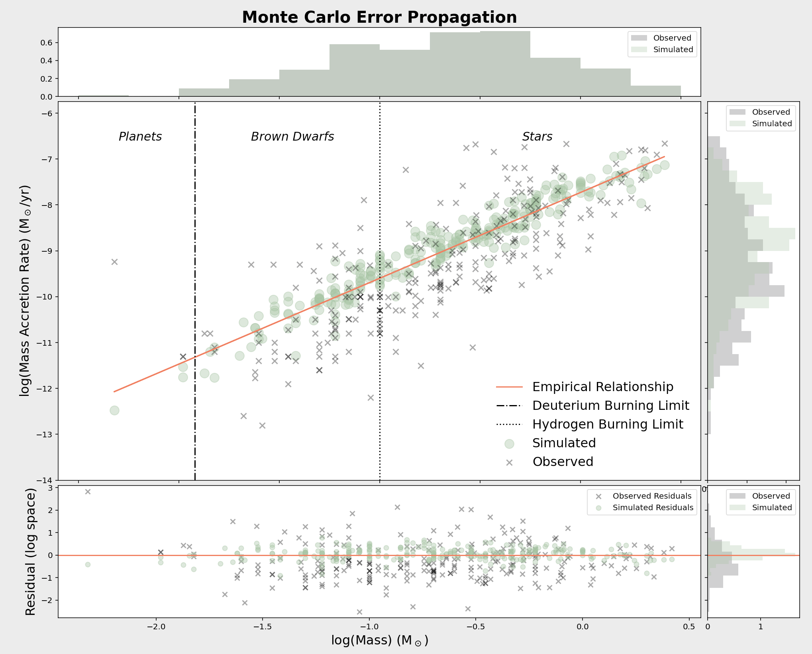

# thesis-work
This repository contains all of the code related to my senior honors thesis in astronomy, titled: Simulated Scatter: Computational Modeling of (Sub)Stellar Accretion. My project will consist of a Monte Carlo error propagation, and will generate a simulated distribution of accretion rates given uncertainty values for each leg of the process that goes into measuring and calculating the value. With our simulated distribution, we will be able to separate systematic uncertainties such as observational error, parameter estimation error, and scaling relationship uncertainty, from physical uncertainties. By isolating the physical scatter in the distribution, we learn more about deep questions surrounding the formation of planetary systems in our universe.

